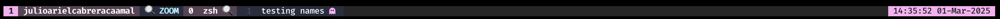

# Gleam Theme for Tmux

A clean and elegant theme for tmux with a modern color palette inspired by Gleam.



## Features

- Clean and minimal design
- Session, window and pane indicators
- Status indicators for:
  - Prefix key activation (⌨)
  - Copy mode (✂)
  - Zoom mode (🔍)
  - SSH connections (🌐)
- Activity and bell indicators
- Date and time display
- Custom pane borders

## Requirements

- tmux version 3.4 or higher
- A terminal that supports 256 colors

## Installation

### Using TPM (Tmux Plugin Manager) [Recommended]

First, install [TPM](https://github.com/tmux-plugins/tpm) if you haven't already:

Add the plugin to your `~/.tmux.conf`:

```bash
set -g @plugin 'juliocabrera820/tmux-gleam-theme'
```

Press `prefix` + I (capital i) to fetch and install the plugin.

### Manual Installation

Clone the repository:

```bash
git clone https://github.com/juliocabrera820/tmux-gleam-theme ~/.tmux/plugins/tmux-gleam-theme
```

Add this line to your `~/.tmux.conf`:

```bash
source-file ~/.tmux/plugins/tmux-gleam-theme/gleam-theme.tmux
```

Reload tmux configuration:

```bash
tmux source-file ~/.tmux.conf
```

## Customization

You can customize the theme by copying `gleam-theme.tmux` to your tmux configuration directory and modifying the colors and formats to your liking.

## Key Bindings Reference

- `prefix + z`: Toggle zoom on the current pane
- `prefix + [`: Enter copy mode
- `prefix + ]`: Paste from buffer

Note: By default, the prefix key is set to `Ctrl + b`

## Contributing

Contributions are welcome! Please feel free to submit a Pull Request.

## Credits

Created by Julio Cabrera
Inspired by the Gleam programming language color scheme.

## Support

If you have any questions or issues, please open an issue on the GitHub repository.
